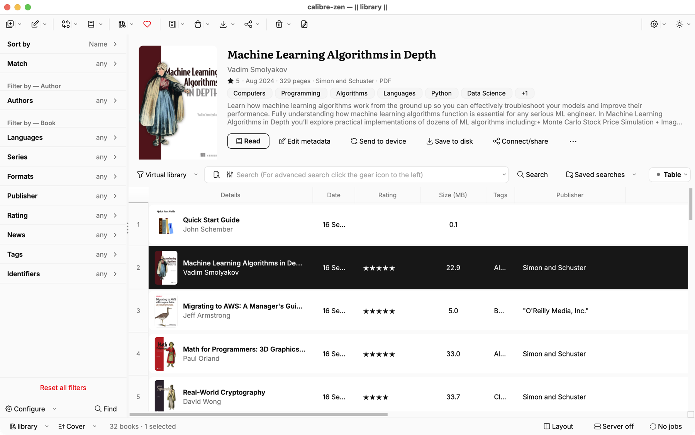

# calibre-zen


A modern calibre for people who love ebooks.

calibre-zen rethinks calibre's interface so the hard things get easy and the easy things get trivial. Same library manager, far less friction.

It installs as a separate app, so **calibre stays untouched**. Run both at once. Your libraries, settings and plugins do not move.

[Website](https://zen.purplecandy.dev) · [Demo](https://youtu.be/Lc22AfF9u2c) · [Releases](https://github.com/purplecandy/calibre-zen/releases)

<br clear="left"/>



---

## Status

Early access. Packages for macOS (universal), Linux (x86_64 and arm64) and Windows (x64) are built by CI from calibre's own release binaries; see [BUILDING.md](BUILDING.md) for how, and the [releases page](https://github.com/purplecandy/calibre-zen/releases) for downloads.

### Install on Linux

Run this from the folder where you want the app. It downloads the latest Linux release for your computer, checks its SHA-256, extracts it, and checks the launchers:

```sh
curl -fL https://raw.githubusercontent.com/purplecandy/calibre-zen/zen/packaging/linux/install-zen.sh -o install-zen.sh && sh install-zen.sh --latest && ./calibre-zen/calibre-zen --version
```

If you downloaded the `.txz` and matching `.sha256` files yourself, run `sha256sum -c <archive>.sha256` and then `sh install-zen.sh <archive>.txz`. On a minimal system, install missing graphics libraries for your distro:

| Distro | Command |
| --- | --- |
| Ubuntu or Debian | `sudo apt install libopengl0 libgl1 libxcb-cursor0` |
| Fedora | `sudo dnf install libglvnd-opengl libglvnd-glx xcb-util-cursor` |
| openSUSE | `sudo zypper install libglvnd Mesa-libGL1 libxcb-cursor0` |
| Arch | `sudo pacman -S libglvnd xcb-util-cursor` |

Move any existing `calibre-zen` folder aside before running the installer. Keep it until the new copy opens.

The interface has had a full overhaul, so expect some bugs. Back up your library before doing anything destructive.

**macOS:** the app is not notarized, so a double-click is refused the first time. Right-click the app, choose Open, once. **Windows:** SmartScreen will warn until the download has built a reputation; choose "More info" and run anyway.

### Roadmap

- The ebook reader
- Bulk metadata editing and the other common operations
- Reading stats out of the box
- More to follow

## What is different

- **Filter panel** in place of the tag browser: one screenful of rows at a time, counts beside each value, and a Reset that clears the lot
- **Split centre pane** with a preview of the selected book above the list, plus a Grid/Table switcher
- **Rebuilt book list** on tall row cards, while sorting, inline editing, column resizing and the header menu stay calibre's own
- **Cover grid** with three densities and every cover cropped to one shape
- **Status bar** that reports the current library, the sort, content server status and any running job
- **One token set** behind the whole stylesheet: colour ramp, radius scale, type scale, density
- **179 icons** redrawn as line glyphs, inked in the palette colour and re-inked when the palette changes
- **Six colour schemes** with match system, light, dim and dark, applied without a restart
- **Inter and Literata** bundled, so the interface reads the same on every machine
- **A compact Edit metadata dialog** that fits beside the library. Fields sit in tidy groups with full labels, and your own columns get the same layout
- **Star ratings you click** instead of a list of star characters. The scroll wheel no longer changes a rating by accident
- **A calendar that matches the theme**, with Today and Clear buttons right under the dates
- **Drop-down lists that look like menus**, with room between the rows and a clear highlight
- **Download metadata with a preview.** Each match is a card, and you can see what would change before you pick one
- **Text fields with one border**, and a formatting toolbar that fits on one line

## FAQ

### Do my libraries and plugins still work?

Yes. Your existing libraries open as they are. calibre plugins work too. calibre-zen keeps its own settings, and the first time it opens it offers to bring over your calibre settings and plugins. calibre keeps its own copy.

### Does it run on my computer?

Yes. There are builds for macOS, Linux and Windows.

### Why not add this to calibre itself?

calibre-zen is more than 50,000 lines of changes on top of calibre. It is rewriting the whole interface step by step, with its own components, theme engine and way of drawing the screen. calibre is the core, and calibre-zen is the layer you see.

A change that big is hard to send upstream in one go. calibre has always put function first, and calibre-zen is about form, so the two projects want different things right now. This is a personal project, built in my own time, and it follows my idea of what calibre can look like. You are welcome to take any part of it to calibre.

## How it works

Nothing here edits calibre.

calibre-zen uses its own config directory, single-instance lock, IPC socket and bundle identifier, so it installs beside calibre rather than on top of it. Its command line tools are prefixed `zen-`, so `zen-ebook-convert` and `ebook-convert` can coexist.

The restyling lives in an overlay package that patches calibre from the outside. Custom widgets are built by composition and sit in front of calibre's existing models and signals, with the behaviour left where it was. That is what keeps upstream pullable: an idea that does not work out costs one environment variable rather than a merge conflict.

Every piece can be switched off:

```
CALIBRE_ZEN_FILTERS=0    # calibre's tag browser back
CALIBRE_ZEN_CENTRE=0     # calibre's centre pane back
CALIBRE_ZEN_STATUS=0     # calibre's status bar back
CALIBRE_ZEN_EDITOR=0     # calibre's Edit metadata layouts back
CALIBRE_ZEN_RATING=0     # calibre's rating list back
CALIBRE_ZEN_DATES=0      # Qt's calendar back
CALIBRE_ZEN_DOWNLOAD=0   # calibre's Download metadata dialog back
```

## Building

See [BUILDING.md](BUILDING.md) for packaging and the [guides](docs/README.md) for recurring tasks, including upstream updates.

## Contributing

Issues and pull requests are welcome. Bug reports about calibre itself belong [upstream](https://github.com/kovidgoyal/calibre); anything about the interface belongs here.

## Licence

GPL-3.0, same as calibre.

## Credits

calibre is built by [Kovid Goyal](https://calibre-ebook.com) and this fork would not exist without it. calibre-zen is not affiliated with or endorsed by the calibre project.

### Third party

- [Tabler Icons](https://tabler.io/icons) by Paweł Kuna, MIT licence. The icon set behind every line glyph in the interface
- [Inter](https://rsms.me/inter/) by Rasmus Andersson, SIL Open Font Licence 1.1
- [Literata](https://github.com/googlefonts/literata) by TypeTogether, SIL Open Font Licence 1.1
